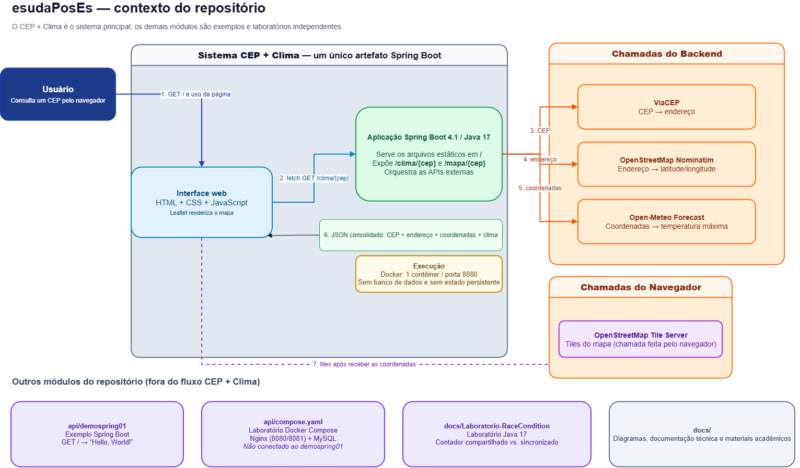
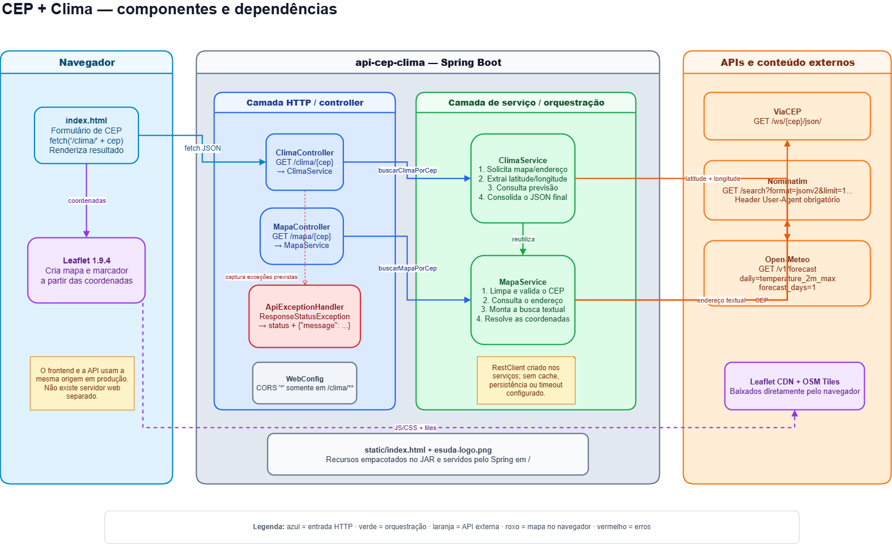
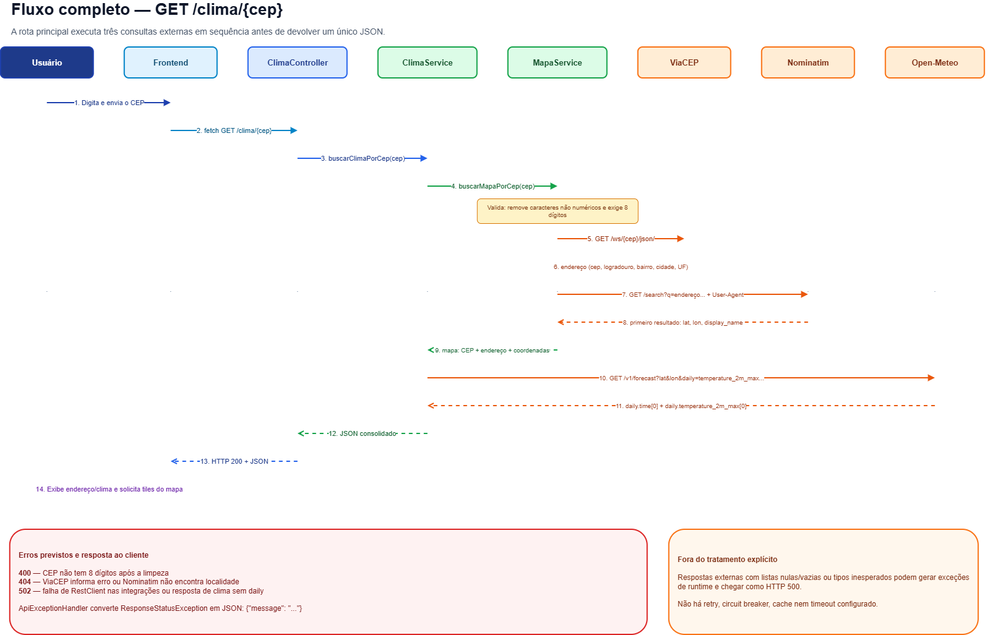
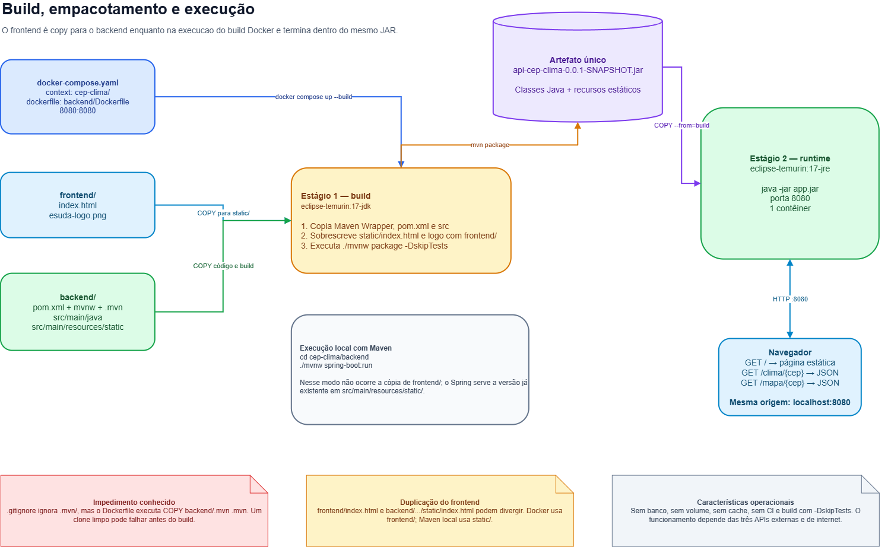

# Arquitetura: CEP + Clima

Documentação técnica do projeto CEP + Clima, desenvolvido no curso da Faculdade ESUDA.

Para instalar e executar, veja o [README do projeto](../cep-clima/README.md). Este documento
descreve **como o sistema funciona por dentro** e por que foi construído assim.

## Índice

1. [Visão geral](#1-visão-geral)
2. [Diagrama de arquitetura](#2-diagrama-de-arquitetura)
3. [Componentes](#3-componentes)
4. [Fluxo de uma requisição](#4-fluxo-de-uma-requisição)
5. [Integrações externas](#5-integrações-externas)
6. [Tratamento de erros](#6-tratamento-de-erros)
7. [Build e execução](#7-build-e-execução)
8. [Limitações conhecidas](#8-limitações-conhecidas)

---

## 1. Visão geral

O sistema recebe um CEP brasileiro e devolve o endereço correspondente, suas coordenadas
geográficas e a temperatura máxima prevista para o dia naquela localidade.

Não há banco de dados nem estado próprio: cada requisição é resolvida consultando três APIs
públicas em sequência. O valor do sistema está inteiramente na **orquestração** dessas
chamadas: traduzir CEP em endereço, endereço em coordenada, coordenada em previsão.

### Decisões estruturais

Quatro escolhas definem o formato do projeto:

**Um único artefato serve API e interface.** Não existe servidor web separado nem processo
de build de frontend: a interface inteira é um `index.html` com CSS e JavaScript embutidos,
que junto do logo forma os dois únicos recursos estáticos empacotados no JAR e servidos pelo
Spring em `/`. Página e API compartilham a mesma origem, o que torna o CORS desnecessário em
produção e reduz o deploy a um contêiner. O bean `WebConfig` é resquício do período em que o
frontend rodava separado, daí a regra permissiva descrita na [seção 3](#3-componentes).

**A orquestração vive na camada de serviço.** Os controllers recebem o CEP e delegam, sem
um `try/catch` sequer. Toda a coordenação das chamadas externas fica nos serviços,
e o tratamento de erro é centralizado em um único ponto ([seção 6](#6-tratamento-de-erros)).

**O fuso horário é resolvido na origem.** A consulta ao Open-Meteo envia `timezone=auto`,
fazendo a API calcular o dia segundo o fuso do ponto consultado. Sem esse parâmetro, "hoje"
seria calculado em UTC e a previsão poderia se referir ao dia seguinte no Brasil.

**Os recursos do Leaflet são verificados.** O CSS e o JavaScript da biblioteca são
carregados com `integrity` e `crossorigin`, de modo que um CDN comprometido não consegue
injetar código na página. A folha do Google Fonts, também externa, não tem essa proteção.

O projeto declara **uma única dependência**, `spring-boot-starter-webmvc`, sobre Spring Boot
4.1.0 e Java 17. Não há starter de teste, de persistência nem de observabilidade, o que
explica boa parte das [limitações da seção 8](#8-limitações-conhecidas).

---

## 2. Diagrama de arquitetura



*Página 01: contexto e escopo. O arquivo editável,
[`Felipe.drawio`](Felipe.drawio), reúne as quatro páginas:*

| Página | Conteúdo | Seção correspondente |
|--------|----------|---------------------|
| 01 — Contexto e escopo | Fronteira do sistema, dependências externas e módulos satélites | [1](#1-visão-geral) e [5](#5-integrações-externas) |
| 02 — Componentes CEP Clima | Classes reais e quem chama quem | [3](#3-componentes) |
| 03 — Fluxo GET clima | Sequência completa da rota principal | [4](#4-fluxo-de-uma-requisição) |
| 04 — Build e execução | Pipeline Docker multi-estágio | [7](#7-build-e-execução) |

O arquivo abre em [draw.io](https://app.diagrams.net). Este documento complementa o
diagrama em vez de repeti-lo: o desenho mostra **o que** existe e como se conecta; o texto
explica **por quê** e registra o que um diagrama não consegue expressar.

---

## 3. Componentes



O backend tem sete classes em três camadas.

| Classe | Camada | Responsabilidade | Depende de |
|--------|--------|------------------|------------|
| `CepClimaApplication` | — | Ponto de entrada do Spring Boot | — |
| `ClimaController` | Entrada | Expõe `GET /clima/{cep}` | `ClimaService` |
| `MapaController` | Entrada | Expõe `GET /mapa/{cep}` | `MapaService` |
| `ApiExceptionHandler` | Entrada | Converte `ResponseStatusException` em JSON de erro | — |
| `WebConfig` | Configuração | Libera CORS com origem `*` apenas em `/clima/**` | — |
| `ClimaService` | Domínio | Consulta a previsão e consolida a resposta | `MapaService` |
| `MapaService` | Domínio | Valida o CEP, resolve endereço e coordenadas | — |

Na árvore de pacotes, `WebConfig` fica em `config/`, os três primeiros da camada de entrada
em `controller/` e os dois serviços em `service/`.

As colaborações entre beans são recebidas por construtor: cada controller recebe seu serviço
e `ClimaService` recebe `MapaService`. O `RestClient`, porém, é criado dentro de cada
serviço com `RestClient.create()`. Isso mantém o código curto, mas é também o motivo de não
haver timeout configurável e de os serviços não poderem ser exercitados em teste sem acessar
a rede. As duas consequências aparecem na [seção 8](#8-limitações-conhecidas).

### MapaService é a peça central

Apesar do nome, a classe cobre três etapas: **valida** o CEP, consulta o **ViaCEP** e
consulta o **Nominatim**. Concentrá-las num só ponto é justamente o que permite a
`/clima/{cep}` e `/mapa/{cep}` compartilharem a mesma validação.

Disso decorre uma dependência que a estrutura de pastas não revela: `ClimaService` **depende
de** `MapaService` e reutiliza seu resultado, em vez de repetir a consulta ao ViaCEP. O
endpoint `/clima/{cep}` executa internamente todo o trabalho de `/mapa/{cep}` antes de
buscar a previsão, por isso sua resposta é um superconjunto da do outro, e por isso a
validação do CEP acontece num único lugar para ambos.

### Dois detalhes que o desenho não alcança

`ApiExceptionHandler` é anotado com `@RestControllerAdvice`, portanto vale para **todos** os
controllers, não apenas para aquele de onde parte a seta no diagrama.

E `/mapa/{cep}` **não tem consumidor**: o frontend chama exclusivamente `/clima/{cep}`. O
endpoint funciona e está documentado, mas hoje existe apenas para uso direto da API.

---

## 4. Fluxo de uma requisição



O diagrama acima traz a sequência completa das quatorze mensagens. Esta seção cobre o que a
sequência não mostra: por que cada etapa existe e o que ela custa.

### Validação em duas camadas

O CEP é limpo e conferido duas vezes: no JavaScript, antes do `fetch`, e em
`MapaService.validarCep`, que remove tudo que não for dígito e exige exatamente oito. A
duplicação é intencional: a checagem do frontend dá resposta imediata sem custo de rede; a
do backend é a que efetivamente protege, já que a API é pública e pode ser chamada
diretamente. É também o motivo de `50050-480` e `50050480` serem equivalentes.

### As três chamadas são estritamente sequenciais

Cada etapa depende do resultado da anterior: sem endereço não há busca no Nominatim, sem
coordenadas não há previsão. Nada pode ser paralelizado.

A consequência é que a latência percebida é a **soma** de três chamadas externas, e a
disponibilidade do sistema é o **produto** das três: basta uma falhar para a requisição
inteira falhar. Nenhuma resposta é reaproveitada entre requisições.

### A geocodificação é uma aposta calculada

O Nominatim não aceita CEP como chave: faz busca textual. `MapaService` concatena
logradouro, bairro, localidade, UF e CEP numa única string, restringe a `countrycodes=br` e
pede `limit=1`, aceitando sempre o primeiro resultado.

A precisão depende, portanto, da qualidade do texto montado. Um CEP único de cidade pequena,
sem logradouro, produz busca mais genérica e tende a resolver para o centro do município em
vez da rua exata. Para o escopo do projeto, que é mostrar a temperatura da localidade, a
aproximação é suficiente. Na verificação, CEPs de municípios pequenos foram resolvidos sem
falha, embora a precisão da coordenada não tenha sido medida.

### A previsão fecha o ciclo

`ClimaService` envia `latitude` e `longitude` ao Open-Meteo pedindo
`daily=temperature_2m_max`, `forecast_days=1` e `timezone=auto`, e acrescenta o bloco
`clima` ao objeto devolvido por `MapaService`.

---

## 5. Integrações externas

As APIs consumidas pelo backend são públicas, gratuitas e não exigem chave. Seus parâmetros
e campos estão detalhados em [third-party/README.md](../cep-clima/third-party/README.md);
esta seção cobre apenas o que constitui decisão de arquitetura.

### Por que três APIs

Nenhuma delas resolve o problema sozinha. O ViaCEP conhece CEPs, mas não coordenadas. O
Open-Meteo precisa de latitude e longitude e não sabe o que é um CEP. O Nominatim é a ponte
entre os dois. Daí o encadeamento, e daí também o fato de que a latência de uma consulta é
a **soma** de três chamadas de rede, não a de uma.

### Duas categorias de chamada externa

O sistema depende de sete hosts externos, divididos em dois grupos com propriedades bem
diferentes:

| Origem | Serviço | Finalidade |
|--------|---------|-----------|
| Backend | ViaCEP | CEP → endereço |
| Backend | Nominatim | Endereço → coordenadas |
| Backend | Open-Meteo | Coordenadas → temperatura máxima |
| Navegador | `tile.openstreetmap.org` | Imagens do mapa |
| Navegador | `unpkg.com` | CSS e JavaScript do Leaflet |
| Navegador | `fonts.googleapis.com` | Folha de estilo das fontes |
| Navegador | `fonts.gstatic.com` | Arquivos de fonte propriamente ditos |

A distinção tem consequências práticas. As chamadas do navegador partem da máquina do
usuário e expõem o IP dele a terceiros; as do backend partem do servidor. Os tiles seguem
disponíveis mesmo com o backend fora, mas isso não se traduz em mapa na tela: a interface
esconde o mapa a cada nova busca e só volta a exibi-lo depois de uma resposta bem-sucedida.

Os recursos do Leaflet são carregados com verificação de integridade (`integrity` e
`crossorigin`), o que impede que um CDN comprometido injete código na página. A folha do
Google Fonts é carregada sem essa verificação.

### Restrições do Nominatim

O Nominatim é operado pela OpenStreetMap Foundation e mantido por doações. Sua política de
uso impõe condições que afetam diretamente este projeto:

- **`User-Agent` identificando a aplicação é obrigatório.** Requisições sem ele são
  bloqueadas. O projeto envia `cep-clima-esuda/1.0`, cumprindo a exigência.
- **No máximo uma requisição por segundo.**
- **Uso intenso deve rodar em instância própria**, não no serviço público.

O sistema não implementa cache nem controle de taxa: cada consulta gera uma chamada nova,
mesmo para um CEP consultado segundos antes. Para o uso acadêmico a que o projeto se
destina isso é aceitável; sob concorrência real, é o primeiro ponto a mudar, conforme a
[seção 8](#8-limitações-conhecidas).

### Acoplamento a formatos externos

As respostas são consumidas como `Map<String, Object>`, com as chaves lidas por nome em
tempo de execução (`daily`, `temperature_2m_max`, `lat`, `lon`). Não existe classe que
descreva o formato esperado. O código fica curto; em troca, uma mudança de formato em
qualquer das três APIs só se manifesta quando a requisição roda, nunca na compilação.

O tratamento do campo `erro` do ViaCEP, descrito na [seção 6](#6-tratamento-de-erros),
mostra esse custo na prática.

---

## 6. Tratamento de erros

Os serviços não devolvem código de erro nem `null` quando algo falha: lançam
`ResponseStatusException`, carregando o status HTTP e a mensagem. `ApiExceptionHandler`,
anotado com `@RestControllerAdvice`, intercepta essas exceções em qualquer controller e as
converte num corpo JSON uniforme:

```json
{ "message": "CEP inválido" }
```

A vantagem do arranjo é que os controllers não têm nenhum `try/catch`, apenas delegam.
Falhas de rede nas chamadas externas são capturadas como `RestClientException` dentro de
cada serviço e reempacotadas como `502 Bad Gateway`, o que distingue "o serviço externo
falhou" de "o pedido do usuário estava errado".

O handler declara `@ExceptionHandler(ResponseStatusException.class)` e nada além disso. Toda
exceção de outro tipo passa por fora dele e cai no tratamento padrão do Spring Boot, que
responde `500` com um corpo diferente: `timestamp`, `status`, `error` e `path`, em vez de
`message`. O formato de erro descrito acima vale, portanto, para as falhas previstas; os
caminhos discutidos na [seção 8](#8-limitações-conhecidas) responderiam noutro formato.

### Comportamento observado

Medido com a aplicação em execução, ~80 requisições reais:

| Requisição | Status | Corpo |
|-----------|--------|-------|
| `/clima/50050480` | `200` | JSON com `cep`, `endereco`, `coordenadas` e `clima` |
| `/clima/50050-480` | `200` | Idêntico, o hífen é aceito |
| `/clima/123` | `400` | `{"message":"CEP inválido"}` |
| `/clima/abcdefgh` | `400` | `{"message":"CEP inválido"}` |
| `/clima/99999999` | `404` | `{"message":"Localidade não encontrada"}` |
| `/mapa/50050480` | `200` | Mesmo JSON, sem o bloco `clima` |
| `/mapa/99999999` | `404` | `{"message":"Localidade não encontrada"}` |
| `/` | `200` | Página HTML |
| Muitas requisições simultâneas | `502` | `{"message":"Erro ao consultar API de mapa"}` |

Na verificação apareceram três mensagens: `CEP inválido`, `Localidade não encontrada` e
`Erro ao consultar API de mapa`. Das outras três definidas no código, duas,
`Erro ao consultar API do ViaCEP` e `Erro ao consultar API de clima`, simplesmente não
dispararam, porque essas APIs se mantiveram no ar. A terceira é o caso abaixo.

### De onde vem o 404 de CEP inexistente

`MapaService` tenta detectar CEP inexistente logo após consultar o ViaCEP:

```java
if (viaCep == null || Boolean.TRUE.equals(viaCep.get("erro"))) {
    throw new ResponseStatusException(HttpStatus.NOT_FOUND, "CEP não encontrado");
}
```

Só que o ViaCEP devolve esse campo como **texto**, não como booleano:

```
$ curl https://viacep.com.br/ws/99999999/json/
HTTP 200   {"erro": "true"}
```

`Boolean.TRUE.equals("true")` é `false`, já que a comparação é entre tipos diferentes. A condição
não se cumpre e a mensagem `"CEP não encontrado"` não chega a ser usada. O que acontece de
fato (`MapaService.java:95`):

1. O ViaCEP responde `200` com `{"erro": "true"}`
2. A verificação não dispara; o fluxo segue com `localidade` e `uf` nulos
3. A busca textual é montada como `", , null, null, "`, pois `String.join` escreve nulos como a palavra `null`
4. O Nominatim não encontra nada e devolve lista vazia
5. Aí sim nasce o `404`, com a mensagem `"Localidade não encontrada"`

O status final é o mesmo que se esperaria, então o comportamento externo está correto. O
custo é interno: a mensagem atribui ao mapa uma falha que é do CEP, e **cada CEP inexistente
consome uma chamada desnecessária ao Nominatim**, serviço limitado a uma requisição por
segundo.

### O que chega ao log

`ApiExceptionHandler` converte a exceção em JSON e devolve ao cliente; o fluxo não passa por
nenhum logger. Na verificação, o log terminou com 22 linhas, todas de inicialização,
depois de mais de cinquenta respostas `502`.

O efeito prático é que a resposta HTTP é a única fonte de informação sobre uma falha: quem
opera o sistema não consegue saber, pelo log, que um serviço externo esteve indisponível.

---

## 7. Build e execução



O `Dockerfile` usa build em dois estágios. O primeiro parte de uma imagem com JDK, copia o
`pom.xml`, o código-fonte e, este é o ponto importante, copia `frontend/index.html` e
`frontend/esuda-logo.png` para `src/main/resources/static/`, embutindo o frontend no JAR. O
segundo estágio parte de uma imagem apenas com JRE e recebe só o JAR produzido, o que reduz
bastante a imagem final.

O `docker-compose.yaml` declara `context: .` na raiz de `cep-clima/`, e não em `backend/`,
justamente porque o build precisa enxergar as duas pastas ao mesmo tempo.

### A cópia do frontend

`index.html` existe em dois lugares do repositório: `frontend/index.html` e
`backend/src/main/resources/static/index.html`. O build Docker sobrescreve o segundo com o
primeiro, portanto **o Docker sempre serve a versão de `frontend/`**.

Executando pelo Maven, sem Docker, essa cópia não acontece e o Spring serve o arquivo que
estiver em `static/`. Como as duas cópias podem divergir, e atualmente divergem, os dois
modos de execução podem apresentar telas diferentes.

### O Maven Wrapper ausente

Como já registrado em
[backend/README.md](../cep-clima/backend/README.md#problema-conhecido) e na página 04 do
diagrama, o `.gitignore` ignora `.mvn/` enquanto o `Dockerfile` executa
`COPY backend/.mvn .mvn`.

O ângulo que os READMEs não cobrem é que o mesmo arquivo ausente atinge os **dois** caminhos
de execução. O `mvnw` também depende dele, como se verifica em clone limpo:

```
$ ls -a cep-clima/backend
.dockerignore  .gitattributes  Dockerfile  README.md  mvnw  mvnw.cmd  pom.xml  src

$ ./mvnw -v
./mvnw: line 117: ./.mvn/wrapper/maven-wrapper.properties: No such file or directory
```

Ou seja, o caminho alternativo `./mvnw spring-boot:run` esbarra no mesmo obstáculo que o
build Docker: um `mvn` instalado no sistema funcionaria, o wrapper não.

Versionar `backend/.mvn/wrapper/maven-wrapper.properties` resolveria os dois de uma vez.
Como o `.gitignore` ignora o diretório inteiro, não basta uma negação com `!`: seria preciso
trocar o padrão para `.mvn/*` mais `!.mvn/wrapper/`, ou adicionar o arquivo com
`git add -f`.

Vale registrar o que a verificação comprovou: o código-fonte **compila e roda sem nenhuma
alteração**. O impedimento é o arquivo de configuração ausente, não o projeto.

---

## 8. Limitações conhecidas

Registradas para quem for continuar o projeto. Não são defeitos ocultos, são consequências
conhecidas do escopo acadêmico.

| Limitação | Efeito |
|-----------|--------|
| Sem testes automatizados; o build usa `-DskipTests` | Nenhuma regressão é detectada automaticamente |
| Sem integração contínua | Nenhuma verificação automática roda sobre um pull request |
| Sem timeout nas chamadas HTTP | Uma API externa lenta prende a thread que atende a requisição |
| Sem cache nem controle de taxa | Consultas repetidas geram chamadas novas e consomem a cota do Nominatim |
| Sem registro de erros em log | Falhas externas não deixam rastro para diagnóstico |
| `index.html` duplicado | As cópias já divergem em uma linha, e nada garante que sigam sincronizadas |
| Respostas modeladas como `Map` | O contrato está documentado em prosa, mas não é verificado em compilação nem por schema |
| `server.port` fixo em 8080 | A porta não é configurável por variável de ambiente |
| Dependência total de serviços externos | Sem internet, ou com qualquer das três APIs fora, o sistema não responde |

### Robustez defensiva

A página 03 do diagrama já registra, na caixa "fora do tratamento explícito", que respostas
externas com listas nulas ou vazias podem gerar exceção de runtime. São três premissas: a
lista devolvida pelo Nominatim nunca é nula, as listas de previsão nunca vêm vazias, e os
campos aninhados sempre têm o tipo esperado no cast.

A verificação buscou ativamente violá-las e não conseguiu: o Nominatim devolve lista vazia
em vez de corpo nulo, e o Open-Meteo com `forecast_days=1` sempre retorna um elemento.
Nenhum `500` ocorreu em cerca de oitenta requisições, incluindo dois picos de concorrência.

O risco apontado no diagrama existe no código, mas depende de as APIs mudarem de
comportamento. É robustez a endurecer, não falha observada.

### Fragilidade sob concorrência

O Nominatim aplica limite de uso de forma agressiva. Na verificação, quarenta requisições
simultâneas resultaram em `502` para todas, e o endereço IP permaneceu bloqueado por mais de
cinco minutos, enquanto ViaCEP e Open-Meteo seguiam respondendo normalmente. Sem cache,
repetição ou controle de taxa, sob uso concorrente moderado a funcionalidade fica
indisponível até o bloqueio expirar.

---

[README do projeto](../cep-clima/README.md) · [README do repositório](../README.md) · [Faculdade ESUDA](https://esuda.edu.br)
