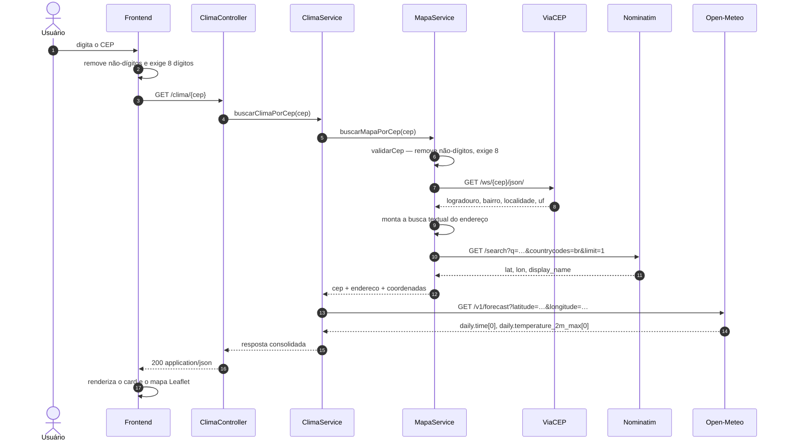

# Documentação Técnica de Arquitetura — Plano de Implementação

> **Para quem for executar (pessoa ou agente):** use a sub-skill `superpowers:subagent-driven-development` (recomendada) ou `superpowers:executing-plans` para implementar tarefa por tarefa. Os passos usam caixas de seleção (`- [ ]`) para acompanhamento.

**Objetivo:** Produzir `docs/arquitetura.md`, referência técnica única do projeto CEP + Clima, orientada ao fluxo da requisição e integrando o diagrama draw.io da implementação.

**Abordagem:** Documento markdown único, em oito seções, escrito na ordem em que uma requisição atravessa o sistema. Todo comportamento HTTP afirmado vem de observação empírica da aplicação em execução, nunca de leitura de código. O documento referencia os READMEs existentes em vez de duplicá-los — este repositório já sofre com duplicação (`index.html` divergiu entre duas cópias), e documentação duplicada diverge pelo mesmo mecanismo.

**Tecnologias:** Markdown, Mermaid (diagrama de sequência, renderizado nativamente pelo GitHub), draw.io (diagrama de arquitetura, fornecido pelo autor).

**Especificação:** `docs/superpowers/specs/2026-08-14-documentacao-tecnica-arquitetura-design.md`

---

## Estrutura de arquivos

| Arquivo | Responsabilidade | Situação |
|---------|------------------|----------|
| `docs/arquitetura.md` | Todo o conteúdo da documentação técnica. Único entregável do PR | Criar |
| `docs/<nome>.drawio` + `.png` | Diagrama de arquitetura da implementação | Fornecido pelo autor |
| `docs/superpowers/specs/*`, `docs/superpowers/plans/*` | Artefatos de processo | **Remover antes do PR** |

Nenhum arquivo de código é criado ou modificado. Nenhum README existente é alterado.

**Por que um arquivo único:** o documento tem oito seções curtas fortemente interligadas — o fluxo da requisição referencia os componentes, que referenciam as integrações, que referenciam os erros. Fragmentar em vários arquivos criaria navegação sem reduzir complexidade, e multiplicaria os pontos de divergência.

---

### Tarefa 1: Consolidar a evidência empírica

Um subagente está executando a coleta em paralelo. Esta tarefa consome o relatório dele. **Nenhuma linha da seção 6 pode ser escrita antes desta tarefa fechar.**

**Arquivos:**
- Criar: `docs/superpowers/evidencia-endpoints.md` (arquivo de trabalho, removido antes do PR)

- [ ] **Passo 1: Receber e conferir o relatório do subagente**

O relatório precisa conter, para cada caso testado: comando curl, status HTTP e corpo literal da resposta. Casos exigidos:

| # | Requisição | Esperado pela documentação atual |
|---|-----------|----------------------------------|
| 1 | `GET /clima/50050480` | 200 |
| 2 | `GET /clima/50050-480` | 200 (aceita hífen) |
| 3 | `GET /clima/123` | 400 |
| 4 | `GET /clima/99999999` | 404 |
| 5 | `GET /clima/abcdefgh` | 400 |
| 6 | `GET /mapa/50050480` | 200 |
| 7 | `GET /mapa/99999999` | 404 |
| 8 | `GET /` | 200, `text/html` |
| 9 | CEPs pouco mapeados (`69931000`, `76993000`, `78890000`) | 404 ou 200 |

- [ ] **Passo 2: Rejeitar qualquer dado não observado**

Se o relatório trouxer um caso marcado como não testado, com falha de execução, ou com corpo reconstruído de memória, esse caso **não entra no documento**. A seção 6 registra apenas o que foi observado; o que não foi observado é omitido ou marcado explicitamente como não verificado.

Este passo existe porque documentar código HTTP por inferência é exatamente o erro que deixou o defeito do `.mvn` passar despercebido por três commits.

- [ ] **Passo 3: Salvar a evidência bruta**

Grave o relatório literal em `docs/superpowers/evidencia-endpoints.md`. Serve de fonte de consulta durante a escrita e de rastro caso alguém questione um valor. É arquivo de trabalho — não vai para o PR.

- [ ] **Passo 4: Commit**

```bash
git add docs/superpowers/evidencia-endpoints.md
git commit -m "chore: registra evidencia empirica dos endpoints"
```

---

### Tarefa 2: Esqueleto e seção 1 — Visão geral

**Arquivos:**
- Criar: `docs/arquitetura.md`

- [ ] **Passo 1: Criar o arquivo com cabeçalho, índice e a seção 1**

```markdown
# Arquitetura — CEP + Clima

Documentação técnica do projeto CEP + Clima, desenvolvido no curso da Faculdade ESUDA.

Para instruções de instalação e execução, veja o [README do projeto](../cep-clima/README.md).
Este documento descreve **como o sistema funciona por dentro**.

## Índice

1. [Visão geral](#1-visão-geral)
2. [Diagrama de arquitetura](#2-diagrama-de-arquitetura)
3. [Componentes](#3-componentes)
4. [Fluxo de uma requisição](#4-fluxo-de-uma-requisição)
5. [Integrações externas](#5-integrações-externas)
6. [Tratamento de erros](#6-tratamento-de-erros)
7. [Build e execução](#7-build-e-execução)
8. [Limitações conhecidas](#8-limitações-conhecidas)

---

## 1. Visão geral

O sistema recebe um CEP brasileiro e devolve o endereço correspondente, suas coordenadas
geográficas e a temperatura máxima prevista para o dia naquela localidade.

Ele não possui banco de dados nem estado próprio: cada requisição é resolvida consultando
três APIs públicas em sequência, e o valor do sistema está inteiramente na **orquestração**
dessas chamadas — traduzir CEP em endereço, endereço em coordenada, coordenada em previsão.

A decisão estruturante do projeto é que **um único artefato Spring Boot serve a API REST e a
interface web**. Não existe servidor web separado nem processo de build de frontend: o HTML,
o CSS e o JavaScript são arquivos estáticos empacotados dentro do próprio JAR, servidos pelo
Spring em `/`. Isso elimina a necessidade de CORS em produção — a página e a API compartilham
a mesma origem — e reduz o deploy a um contêiner único.
```

- [ ] **Passo 2: Verificar que o link relativo resolve**

Executar: `test -f cep-clima/README.md && echo OK` (a partir da raiz do repositório)
Esperado: `OK`

O link é `../cep-clima/README.md` porque `arquitetura.md` vive em `docs/`.

- [ ] **Passo 3: Commit**

```bash
git add docs/arquitetura.md
git commit -m "docs: adiciona visao geral da arquitetura"
```

---

### Tarefa 3: Seção 2 — Diagrama de arquitetura (espaço reservado)

**Arquivos:**
- Modificar: `docs/arquitetura.md`

- [ ] **Passo 1: Adicionar a seção com o marcador**

```markdown
## 2. Diagrama de arquitetura

<!-- DIAGRAMA: substituir este bloco pelo draw.io quando o arquivo for adicionado a docs/ -->

> ⏳ **Diagrama em elaboração.** Esta seção receberá o diagrama de arquitetura da
> implementação. Enquanto isso, a [seção 4](#4-fluxo-de-uma-requisição) traz o diagrama
> de sequência do fluxo completo.

<!-- Formato final, após o arquivo ser adicionado:


*Arquivo editável: [`<nome>.drawio`](<nome>.drawio) — abra em [draw.io](https://app.diagrams.net).*

-->
```

O marcador HTML é comentário: não aparece no markdown renderizado, mas é localizável por busca (`grep DIAGRAMA`) quando o arquivo chegar.

- [ ] **Passo 2: Confirmar que o aviso aparece e o bloco comentado não**

Executar: `grep -c "Diagrama em elaboração" docs/arquitetura.md`
Esperado: `1`

- [ ] **Passo 3: Commit**

```bash
git add docs/arquitetura.md
git commit -m "docs: reserva secao do diagrama de arquitetura"
```

---

### Tarefa 4: Seção 3 — Componentes

**Arquivos:**
- Modificar: `docs/arquitetura.md`
- Consultar: `cep-clima/backend/src/main/java/br/edu/esuda/cepclima/` (7 classes)

- [ ] **Passo 1: Escrever a tabela de componentes**

```markdown
## 3. Componentes

O backend tem sete classes, organizadas em três camadas.

| Classe | Camada | Responsabilidade | Depende de |
|--------|--------|------------------|------------|
| `CepClimaApplication` | — | Ponto de entrada do Spring Boot | — |
| `WebConfig` | Configuração | Libera CORS para `/clima/**` | — |
| `ClimaController` | Entrada | Expõe `GET /clima/{cep}` | `ClimaService` |
| `MapaController` | Entrada | Expõe `GET /mapa/{cep}` | `MapaService` |
| `ApiExceptionHandler` | Entrada | Converte exceções em JSON de erro | — |
| `ClimaService` | Domínio | Consulta a previsão e consolida a resposta final | `MapaService` |
| `MapaService` | Domínio | Valida o CEP, resolve endereço e coordenadas | — |

Os controllers não contêm lógica: recebem o CEP da URL e delegam. Toda a orquestração
das APIs externas vive na camada de serviço.

### MapaService é a peça central

O nome sugere que a classe apenas resolve coordenadas, mas ela concentra três
responsabilidades: **valida** o CEP, consulta o **ViaCEP** e consulta o **Nominatim**.

Isso cria uma dependência que o desenho das pastas não revela: `ClimaService` **depende de**
`MapaService`. O endpoint `/clima/{cep}` executa internamente todo o trabalho de
`/mapa/{cep}` antes de consultar a previsão. A consequência prática é que qualquer falha
de endereço ou de geocodificação aparece igualmente nos dois endpoints, e a validação do
CEP acontece em um único lugar para ambos.
```

- [ ] **Passo 2: Conferir a tabela contra o código**

Executar: `find cep-clima/backend/src/main/java -name "*.java" | wc -l`
Esperado: `7` — a tabela precisa listar exatamente as classes existentes, nem mais nem menos.

- [ ] **Passo 3: Commit**

```bash
git add docs/arquitetura.md
git commit -m "docs: descreve componentes e suas dependencias"
```

---

### Tarefa 5: Seção 4 — Fluxo de uma requisição

**Arquivos:**
- Modificar: `docs/arquitetura.md`

- [ ] **Passo 1: Inserir o diagrama de sequência em Mermaid**

````markdown
## 4. Fluxo de uma requisição

O caminho completo de `GET /clima/{cep}`:


````

- [ ] **Passo 2: Escrever a narrativa dos quatro estágios**

```markdown
### Estágio 1 — Validação

O CEP chega como texto na URL. `MapaService.validarCep` remove tudo que não for dígito e
exige exatamente oito. Por isso `50050-480` e `50050480` são equivalentes, e um CEP com
letras ou com número errado de dígitos é rejeitado antes de qualquer chamada externa.

A mesma validação existe no JavaScript do frontend, antes do `fetch`. A duplicação é
intencional: a do frontend dá resposta imediata sem custo de rede; a do backend é a que
realmente protege, já que a API é pública e pode ser chamada diretamente.

### Estágio 2 — CEP para endereço

`MapaService` consulta o ViaCEP. Uma particularidade dessa API: **CEP inexistente não
retorna 404** — retorna 200 com o corpo `{"erro": true}`. Por isso a checagem no código
não olha o status HTTP, e sim o campo `erro` do JSON.

### Estágio 3 — Endereço para coordenadas

O Nominatim não aceita CEP como chave de busca; ele faz busca textual. `MapaService` então
concatena logradouro, bairro, localidade, UF e CEP numa única string e envia como `q`,
restringindo a `countrycodes=br` e `limit=1` — sempre o primeiro resultado.

Consequência: a precisão da coordenada depende da qualidade do texto montado. Endereços
sem logradouro (CEP único de cidade pequena) produzem uma busca mais genérica, e a
coordenada tende a cair no centro do município em vez da rua exata.

### Estágio 4 — Coordenadas para previsão

`ClimaService` chama o Open-Meteo com a latitude e a longitude obtidas, pedindo
`daily=temperature_2m_max`, `forecast_days=1` e `timezone=auto`. O `timezone=auto` faz a
API usar o fuso do próprio ponto consultado — sem ele, "hoje" seria calculado em UTC e o
resultado poderia se referir ao dia errado no Brasil.

A resposta final é montada acrescentando o bloco `clima` ao objeto que `MapaService`
devolveu. É por isso que `/clima/{cep}` retorna um superconjunto de `/mapa/{cep}`.
```

- [ ] **Passo 3: Validar a sintaxe do Mermaid**

Executar:
```bash
docker run --rm -v "$(pwd)":/data minlag/mermaid-cli -i /data/docs/arquitetura.md -o /data/tmp-mermaid.png
```
Esperado: execução sem erro de parse.

Se a imagem não estiver disponível, o fallback é conferir a renderização no GitHub após o push — o diagrama precisa aparecer desenhado, não como bloco de código. Remova o arquivo temporário: `rm -f tmp-mermaid*.png`

- [ ] **Passo 4: Commit**

```bash
git add docs/arquitetura.md
git commit -m "docs: documenta o fluxo completo da requisicao"
```

---

### Tarefa 6: Seção 5 — Integrações externas

**Arquivos:**
- Modificar: `docs/arquitetura.md`

- [ ] **Passo 1: Escrever a seção, referenciando o README de third-party**

```markdown
## 5. Integrações externas

As três APIs são públicas, gratuitas e não exigem chave. Os parâmetros e campos de cada
uma estão documentados em [third-party/README.md](../cep-clima/third-party/README.md);
esta seção cobre apenas o que é decisão de arquitetura.

### Por que três APIs

Nenhuma delas resolve o problema sozinha. O ViaCEP conhece CEPs mas não coordenadas.
O Open-Meteo precisa de latitude e longitude e não sabe o que é um CEP. O Nominatim é a
ponte entre os dois. Daí o encadeamento — e daí também o fato de que a latência da resposta
é a **soma** de três chamadas de rede, não a de uma.

### Restrições do Nominatim

O Nominatim é operado pela OpenStreetMap Foundation e mantido por doação. A política de uso
impõe condições que afetam diretamente este projeto:

- **`User-Agent` identificando a aplicação é obrigatório.** Requisições sem ele são
  bloqueadas. O projeto envia `cep-clima-esuda/1.0`.
- **No máximo 1 requisição por segundo.**
- **Uso pesado deve ser servido por instância própria**, não pelo serviço público.

O sistema atual **não implementa cache nem controle de taxa**. Cada consulta de um usuário
gera uma chamada nova, mesmo que o CEP já tenha sido consultado segundos antes. Para o uso
acadêmico a que o projeto se destina isso é aceitável; para uso real, seria o primeiro
ponto a mudar.

### Acoplamento a formatos externos

As respostas são consumidas como `Map<String, Object>`, com as chaves lidas por nome em
tempo de execução (`daily`, `temperature_2m_max`, `lat`, `lon`). Não há classe que descreva
o formato esperado. A vantagem é que o código fica curto; o custo é que uma mudança de
formato em qualquer das três APIs só se manifesta como erro quando a requisição roda.
```

- [ ] **Passo 2: Verificar o link relativo**

Executar: `test -f cep-clima/third-party/README.md && echo OK`
Esperado: `OK`

- [ ] **Passo 3: Commit**

```bash
git add docs/arquitetura.md
git commit -m "docs: registra decisoes das integracoes externas"
```

---

### Tarefa 7: Seção 6 — Tratamento de erros

**Depende da Tarefa 1.** Todos os códigos HTTP desta seção vêm de `docs/superpowers/evidencia-endpoints.md`. Nenhum valor pode ser inferido do código-fonte.

**Arquivos:**
- Modificar: `docs/arquitetura.md`
- Consultar: `docs/superpowers/evidencia-endpoints.md`

- [ ] **Passo 1: Descrever o mecanismo**

````markdown
## 6. Tratamento de erros

Os serviços não retornam código de erro nem `null` quando algo falha: lançam
`ResponseStatusException`, carregando o status HTTP e a mensagem. `ApiExceptionHandler`,
anotado com `@RestControllerAdvice`, intercepta essas exceções em qualquer controller e
as converte num corpo JSON uniforme:

```json
{ "message": "CEP inválido" }
```

A vantagem do arranjo é que os controllers não têm nenhum `try/catch` — eles só delegam.
Falhas de rede nas chamadas externas são capturadas como `RestClientException` dentro de
cada serviço e reempacotadas como `502 Bad Gateway`, o que distingue "o serviço externo
falhou" de "o pedido do usuário estava errado".
````

- [ ] **Passo 2: Montar a tabela com os valores observados**

Preencher a coluna de status **exclusivamente** com o que consta na evidência:

```markdown
### Comportamento observado

Verificado com a aplicação em execução:

| Requisição | Status | Corpo |
|-----------|--------|-------|
| `/clima/50050480` | … | … |
| `/clima/123` | … | … |
| `/clima/99999999` | … | … |
| `/mapa/99999999` | … | … |
```

- [ ] **Passo 3: Registrar as lacunas encontradas**

Se a evidência mostrar caminho que produz `500` não previsto, documentar assim — factual, sem julgamento:

```markdown
### Caminhos não cobertos

Três pontos do código assumem que a resposta externa veio bem-formada e, se essa premissa
falhar, o erro escapa do desenho acima e chega ao cliente como `500`:

| Local | Premissa assumida |
|-------|-------------------|
| `MapaService.java:53` | A lista devolvida pelo Nominatim nunca é `null` |
| `ClimaService.java:52` | `daily.time` e `daily.temperature_2m_max` nunca vêm vazias |
| Ambos os serviços | Os campos aninhados têm sempre o tipo esperado no cast |

São caminhos difíceis de atingir — as APIs raramente respondem assim — mas quando ocorrem
produzem `500`, e não o `502` que o desenho de erros pretende. Estão registrados como
issues.
```

Se a evidência **não** confirmar nenhum 500, escrever exatamente isso: que os caminhos foram tentados e não reproduzidos, mantendo a tabela como risco teórico. Não afirmar comportamento não observado.

- [ ] **Passo 4: Conferir que nenhum status na seção veio de inferência**

Executar: `grep -nE "\b(400|404|500|502)\b" docs/arquitetura.md`

Para cada ocorrência, confirmar linha correspondente na evidência. Sem correspondência, remover ou marcar como não verificado.

- [ ] **Passo 5: Commit**

```bash
git add docs/arquitetura.md
git commit -m "docs: documenta o modelo de erros verificado"
```

---

### Tarefa 8: Seção 7 — Build e execução

**Arquivos:**
- Modificar: `docs/arquitetura.md`

- [ ] **Passo 1: Descrever o build multi-stage**

```markdown
## 7. Build e execução

O `Dockerfile` usa build em dois estágios. O primeiro parte de uma imagem com JDK,
copia o `pom.xml`, o código e — este é o ponto importante — copia `frontend/index.html`
e `frontend/esuda-logo.png` para `src/main/resources/static/`, empacotando o frontend
dentro do JAR. O segundo estágio parte de uma imagem apenas com JRE e recebe só o JAR
produzido, o que reduz a imagem final.

O `docker-compose.yaml` usa `context: .` na raiz de `cep-clima/`, e não em `backend/`,
justamente porque o build precisa enxergar as duas pastas.

### A cópia do frontend

`index.html` existe em dois lugares no repositório: `frontend/index.html` e
`backend/src/main/resources/static/index.html`. O build Docker sobrescreve o segundo com
o primeiro, então **o Docker sempre serve a versão de `frontend/`**.

Rodando pelo Maven, sem Docker, essa cópia não acontece e o Spring serve o arquivo que
estiver em `static/`. Como as duas cópias podem divergir, os dois modos de execução podem
apresentar telas diferentes — e hoje divergem.
```

- [ ] **Passo 2: Registrar o impedimento do build**

````markdown
### Estado atual do build a partir de um clone limpo

O `.gitignore` inclui `.mvn/`, então o diretório do Maven Wrapper não está versionado.
O `Dockerfile` executa `COPY backend/.mvn .mvn`.

Verificado em clone limpo do repositório:

```
$ ls -a cep-clima/backend
.dockerignore  .gitattributes  Dockerfile  README.md  mvnw  mvnw.cmd  pom.xml  src

$ ./mvnw -v
./mvnw: line 117: ./.mvn/wrapper/maven-wrapper.properties: No such file or directory
```

Nessa condição, tanto `docker compose up --build` quanto `./mvnw spring-boot:run` falham.
Versionar `backend/.mvn/wrapper/maven-wrapper.properties` resolve os dois casos. Registrado
como issue.
````

- [ ] **Passo 3: Commit**

```bash
git add docs/arquitetura.md
git commit -m "docs: descreve o build e o impedimento em clone limpo"
```

---

### Tarefa 9: Seção 8 — Limitações conhecidas

**Arquivos:**
- Modificar: `docs/arquitetura.md`

- [ ] **Passo 1: Escrever a seção de fechamento**

```markdown
## 8. Limitações conhecidas

Registradas aqui para quem for continuar o projeto. Não são defeitos ocultos — são
consequências conhecidas do escopo acadêmico.

| Limitação | Efeito |
|-----------|--------|
| Sem testes automatizados; o build usa `-DskipTests` | Nenhuma regressão é detectada automaticamente |
| Sem integração contínua | Nada valida um pull request antes do merge |
| Sem timeout nas chamadas HTTP | Uma API externa lenta prende a thread que atende a requisição |
| Sem cache | Consultas repetidas do mesmo CEP geram chamadas novas e consomem a cota do Nominatim |
| `index.html` duplicado | As duas cópias divergem, e Docker e Maven servem telas diferentes |
| Respostas modeladas como `Map` | O contrato da API não existe de forma verificável em nenhum lugar |
| Dependência total de disponibilidade externa | Sem internet, ou com qualquer das três APIs fora, o sistema não responde |

---

[README do projeto](../cep-clima/README.md) · [README do repositório](../README.md) · [Faculdade ESUDA](https://esuda.edu.br)
```

- [ ] **Passo 2: Commit**

```bash
git add docs/arquitetura.md
git commit -m "docs: registra limitacoes conhecidas"
```

---

### Tarefa 10: Revisão final e preparação do PR

**Arquivos:**
- Modificar: `docs/arquitetura.md`
- Remover: `docs/superpowers/` (artefatos de processo)

- [ ] **Passo 1: Verificar todos os links relativos**

```bash
grep -oE '\]\(([^)#]+)\)' docs/arquitetura.md \
  | sed -E 's/^\]\(//; s/\)$//' \
  | grep -v '^http' \
  | grep -v '<nome>' \
  | while read -r link; do
      target="docs/$link"
      if [ -e "$target" ]; then echo "OK   $link"; else echo "QUEBRADO $link"; fi
    done
```
Esperado: nenhuma linha `QUEBRADO`.

O filtro `grep -v '<nome>'` exclui o modelo de link que vive dentro do bloco comentado da Tarefa 3 — ele é gabarito para o draw.io futuro, não um link real. Quando o diagrama chegar e o bloco for ativado, remova o filtro e rode de novo.

- [ ] **Passo 2: Varredura de placeholders**

Executar: `grep -nEi "TBD|TODO|FIXME|XXX|preencher|\.\.\." docs/arquitetura.md`
Esperado: nenhum resultado — exceto o marcador `<!-- DIAGRAMA -->` da Tarefa 3, que é intencional e continua válido enquanto o draw.io não chegar.

- [ ] **Passo 3: Conferir consistência de nomes**

Executar: `grep -oE "[A-Z][a-zA-Z]+(Service|Controller|Config|Handler|Application)" docs/arquitetura.md | sort -u`

Esperado: exatamente as sete classes reais. Qualquer nome fora dessa lista é erro de digitação.

- [ ] **Passo 4: Conferir o documento contra a especificação**

Abrir `docs/superpowers/specs/2026-08-14-documentacao-tecnica-arquitetura-design.md` e confirmar que as oito seções previstas existem e que nada fora do escopo entrou (sem OpenAPI, sem ADR, sem alteração de código).

Executar: `git diff --stat main...HEAD -- . ':!docs/superpowers'`
Esperado: apenas `docs/arquitetura.md`.

- [ ] **Passo 5: Remover os artefatos de processo**

```bash
git rm -r --cached docs/superpowers
rm -rf docs/superpowers
git commit -m "chore: remove artefatos de processo do branch"
```

Especificação, plano e evidência não pertencem ao repositório compartilhado. Se quiser preservá-los, copie para fora do repositório **antes** de rodar isto.

- [ ] **Passo 6: Confirmar que nenhum arquivo de código foi tocado**

Executar: `git diff --name-only main...HEAD`
Esperado: apenas `docs/arquitetura.md`.

Este é o critério de aceite do PR: um arquivo, zero alterações em código.

- [ ] **Passo 7: Push e abertura do PR**

```bash
git push -u origin docs/arquitetura-tecnica
```

Depois conferir no GitHub: o Mermaid precisa aparecer **desenhado**, não como bloco de código.

---

## Pendências fora deste plano

| Item | Encaminhamento |
|------|----------------|
| Diagrama draw.io | Autor adiciona a `docs/`; a seção 2 é preenchida então |
| 11 achados da review | Issues separadas — ver seção 6 da especificação |
| Especificação OpenAPI | Fora do escopo por decisão; reavaliar depois |
